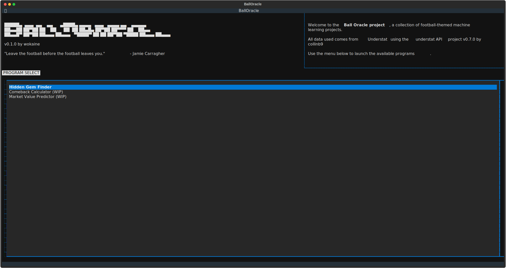
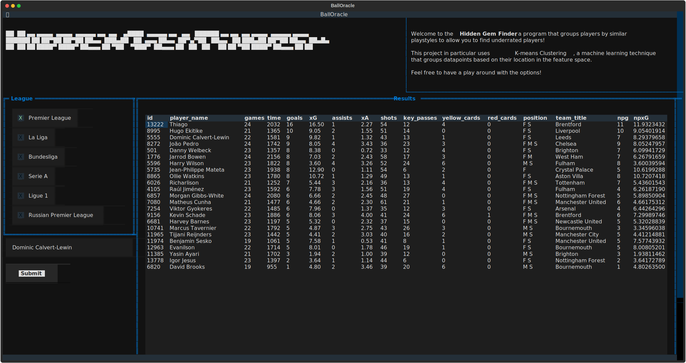

## Contents
- [Contents](#contents)
- [BALL ORACLE v0.2.0](#ball-oracle-v020)
  - [About](#about)
  - [Hidden Gem Finder](#hidden-gem-finder)
  - [Comeback Calculator](#comeback-calculator)
  - [Executing](#executing)
    - [Create venv](#create-venv)
    - [Activate venv](#activate-venv)
    - [Install requirements](#install-requirements)
    - [Run](#run)
  - [What's Next?](#whats-next)

## BALL ORACLE v0.2.0
A collection of football themed machine learning projects presented in a terminal UI.

Author: Freddie Butterfield (wokaine)



### About
For a while I was struggling to motivate myself to develop programs that were beyond what I was already doing at university. Then I had the realisation to combine my interests with computer science, and this project is the result of that.

Ball oracle is a collection of various football analysis programs powered by fundamental machine learning concepts. Currently only two have been implemented: Hidden Gem Finder and Comeback Calculator. I have plans to implement many more (so long as university does not get in the way).

The aim of this is not to provide an amazing tool for football clubs to use, but to rather employ my knowledge of machine learning on to a subject I'm quite interested in. I am limited by the fact that my football analysis knowledge is next-to-none and that I am using data from free sources, both of which will affect the performance and predictions that the tools provide.

The data source I am using for the Hidden Gem Finder is [Understat](https://understat.com/) which supplies rudimentary data from 5 European leagues:
- Premier League (EPL)
- La Liga
- Bundesliga
- Serie A
- Ligue 1
- Russian Football Premier League

This is nicely wrapped up in a [library](https://github.com/collinb9/understatAPI) by user collinb9, so shout out to him!

The data source for the Comeback Calculator comes from [Football Data](https://football-data.co.uk/). Another great free source with a good start for analysis.

[Textual](https://github.com/Textualize/textual) is used for the UI of the project.

### Hidden Gem Finder


The Hidden Gem Finder aims to group players into clusters based on the features provided by Understat through [K-means Clustering](https://en.wikipedia.org/wiki/K-means_clustering). You can then search for a player and analyse the cluster to find players who have a similar play style but are maybe a bit more underrated or underutilised by their team, which could be potentially useful from a recruitment perspective.

### Comeback Calculator
The comeback calculator aims to predict whether the team trailing at half-time will go on to win. This adds a bit more challenge than to just "who will win?" predictors.

The immediate challenge is the lack of data. Not only are comebacks quite rare in football, but good quality match data is kept behind paywalls. The data used comes from the kind folks over at [Football Data](https://football-data.co.uk/). The data used is mostly betting-focused, so there may be a lot of potentially more useful features that may be missing and have affected the model. Still, it's the best I can do for my budget (that is, nothing).

The model itself is an [eXtreme Gradient Boost (XGB)](https://en.wikipedia.org/wiki/XGBoost) classifier which is an efficient ensemble method classifier using decision trees. On top of that, Synthetic Minority Oversampling TEchnique (SMOTE) is also used to overrepresent the minority class (in our case, comebacks). This does give the model a bit too much confidence, but at least it is taking those risks rather than just saying 'no comeback' every time.

Football seasons bring radical changes. At the moment, the model is very biased towards the Big 6 clubs in the PL due to the fact that they've always been really good teams and they've appeared the most in historical data. This means that the model does not reflect (or have any idea about) the current performance of the teams in the current season.

Still, you can see the model and the predictions it has made from this season so far and see where it goes wrong. I would have liked to have done live predictions but I just cannot translate data from different sources into the one that I need (without paying for more detailed data in the first place).

### Executing
At this point in time I have not implemented any way for you to easily test this on your own. Though if you have Python installed and you are desperate you can always download the zip and run it through the terminal:

#### Create venv
```
python -m venv (name of venv)
```

#### Activate venv

(Windows)
```
name_of_venv/scripts/activate
```

(Linux)
```
name_of_venv/bin/activate
```

#### Install requirements
```
python -m pip install -r requirements.txt
```

#### Run
```
python run app.py
```
or
```
textual run app.py
```

### What's Next?
There's a lot of things to be done, especially very boring things.
- [ ] Docstrings
- [ ] Appropriate testing
- [X] Comeback calculator
- [ ] Market value predictor
- [ ] Dockerisation

What you are seeing at the moment is a rough version that I'm happy to show to you, and I hope that I can continue to find the motivation to work on this project! 
